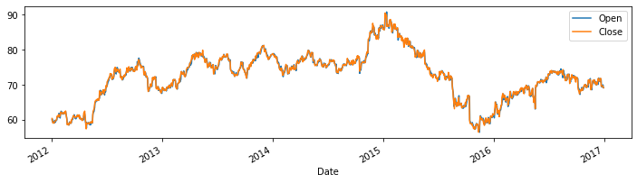
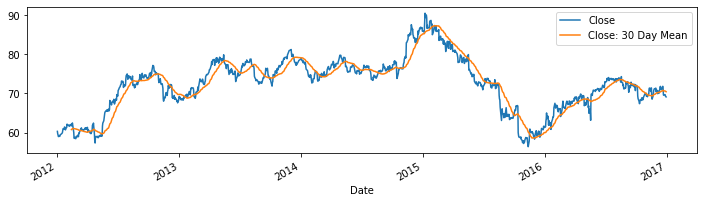
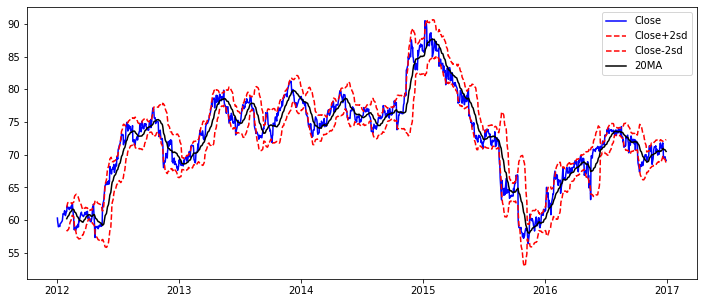
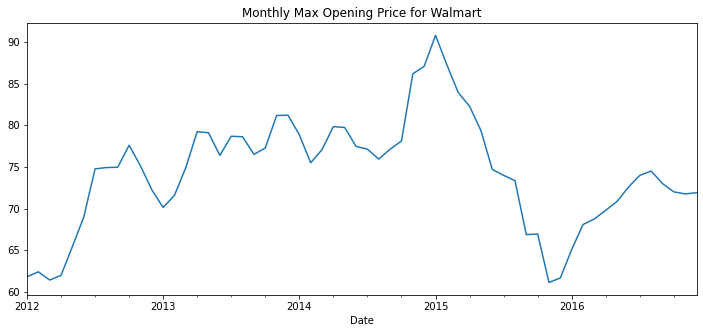

# Time-Series-Data-Primer

Time Series Data Primer in Python includes Jupiter Notebooks on:

1. Introduction to Time Series in Python
2. Pandas Datareader
3. Rolling Expanding
4. Time Resampling
5. Time Shifting

# Few samples attached below:

